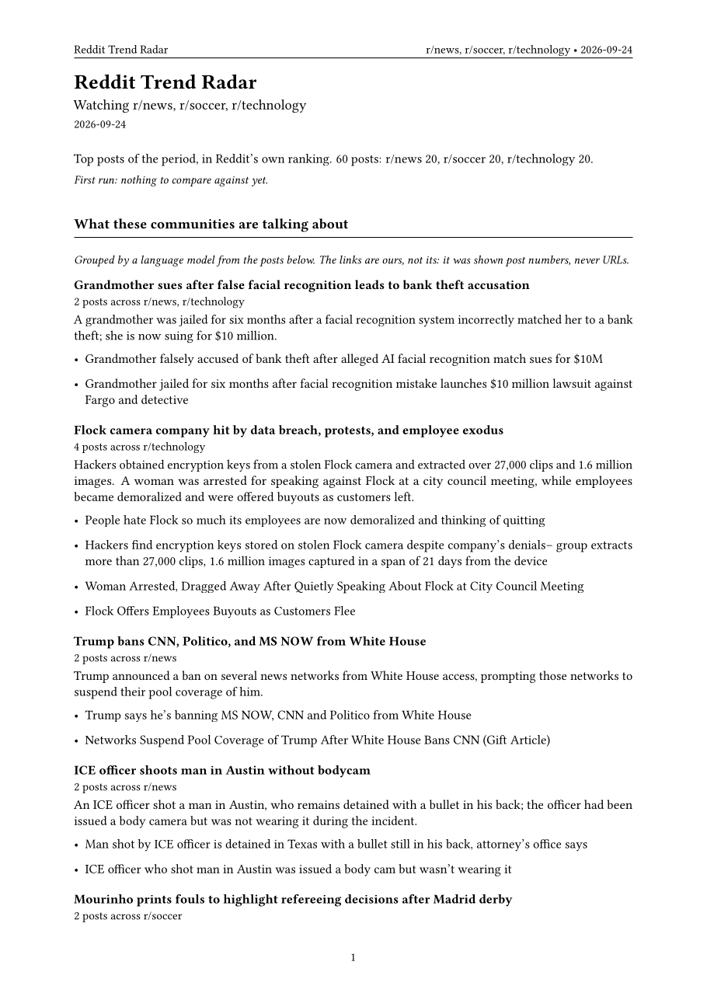

# Reddit Trend Radar

[](https://github.com/yeahyaaa/reddit-trend-radar/actions/workflows/ci.yml)
[](https://www.python.org/downloads/)
[](LICENSE)

This came out of a job, not an afternoon. For five months I ran five company social accounts,
and every week started the same way: a dozen tabs open, guessing what people cared about. I got
tired of guessing and built myself a tool for it. This is that tool, put out in the open.

It is one of a set. The rest are the same kind of thing — the repetitive half of a job, handed
to a script — and they will follow here as I get them into a state fit to publish.

Give it a list of public subreddits and a period. It returns one document with the top posts
from each, in Reddit's own ranking, with a link to every discussion and to whatever article the
post points at. Markdown to read, Excel to sort, CSV to feed somewhere, LaTeX to print.

Nothing in it is about Linux or software. It reads whatever public subreddits you name.

**Contents:** [Output](#what-you-get) · [Running it](#running-it) · [Double-click version](#the-double-click-version)
· [Formats](#four-formats) · [Model step](#reading-the-posts-not-just-counting-them--optional) · [Comparing runs](#comparing-runs) · [Getting data out of Reddit](#getting-data-out-of-reddit)
· [Rate limits](#when-reddit-tells-you-to-slow-down) · [Signing in](#signing-in-optional-and-gated)
· [Terms](#staying-on-the-right-side-of-reddits-terms) · [Tests](#tests) · [Limitations](#what-it-does-not-do)

## What you get

The PDF from a real run, watching r/news, r/soccer and r/technology over one week. The whole
document and every other format are in [`examples/`](examples/).

<p align="center">
  
</p>

The same run as Markdown:

```
# Reddit Trend Radar - 2026-09-24

Watching r/news, r/soccer, r/technology.

Top posts of the period, in Reddit's own ranking. 60 posts: r/news 20, r/soccer 20, r/technology 20.

## r/news

**1. 'Looksmaxxing' influencer Clavicular charged with rape in Massachusetts**

u/givemecoffeenowhurry - 2026-09-22 11:17
[Discussion](https://www.reddit.com/r/news/comments/1wn6nvg/...) - [Source](https://www.nbcnews.com/...)

**2. Uber ordered to pay $40m to family of woman killed after driver left her on highway**

u/FuryOfArcann - 2026-09-18 19:32
[Discussion](https://www.reddit.com/r/news/comments/1wk002p/...) - [Source](https://www.bbc.co.uk/...)
```

Two links per post, because they go to different places. **Discussion** is the Reddit thread,
where the argument is. **Source** is the article the post was about, which is usually what you
actually wanted. A text post has no source, and the field is simply absent rather than
repeating the thread link twice.

## Running it

```bash
pip install -r requirements.txt
python -m radar.cli -s news soccer technology -p week
```

Subreddits can be names, `r/` prefixes, or links pasted straight out of the address bar:

```bash
python -m radar.cli -s https://www.reddit.com/r/news/ r/soccer technology
```

| Flag | What it does | Default |
| --- | --- | --- |
| `-s, --subreddits` | names, `r/` prefixes or pasted Reddit URLs | six open-source ones |
| `-p, --period` | `hour`, `day`, `week`, `month`, `year` | `day` |
| `-l, --limit` | how many posts to pull from each one | 25 |
| `--pause` | seconds between subreddits, when 429s keep coming | 3 |
| `-n, --top` | how many to keep **per subreddit** | 20 |
| `-o, --out` | where to write the Markdown | `radar-report.md` |
| `--csv` | also write a CSV | off |
| `--xlsx` | also write an Excel sheet | off |
| `--tex` | also write a LaTeX document | off |
| `--history` | where past runs are kept | `radar-history.db` |
| `--no-history` | do not read or write history | off |
| `--ai` | group the posts into stories with a language model | off |
| `--ai-provider` | `anthropic`, `openai`, `gemini`, `openrouter` | guessed from the environment |
| `--ai-model` | override the provider's default model | provider default |
| `--ai-free` | OpenRouter only: rotate through its free models | off |
| `-q, --quiet` | only print the final summary | off |

A run reports itself as it goes, because it takes a minute and silence is unhelpful:

```
Reading 3 subreddits, top of the week

  r/news           20 posts  feed
  r/soccer         20 posts  feed
  r/technology    skipped   HTTP 429

Wrote radar-report.md  -  40 posts across 2 communities, 2 shared topics
```

Progress goes to stderr and the summary to stdout, so piping the summary stays clean.

## The double-click version

`radar.bat` asks the two things that change between runs — which communities, over what period
— and writes all four formats into a dated folder under `reports/`, so this week's briefing
never lands on top of last week's. If a LaTeX distribution is installed it compiles the PDF too.

## Four formats

| Format | Flag | For |
| --- | --- | --- |
| Markdown | default | reading in a terminal, a PR, anything that renders Markdown |
| CSV | `--csv` | feeding something else |
| Excel | `--xlsx` | sorting, filtering, clicking through to the threads |
| LaTeX | `--tex` | a PDF to hand to someone |

Every format carries the rank, subreddit, timestamp, author, title, both links and, for text
posts, the body in full. The CSV and the spreadsheet keep the body however long it runs.

The **Excel** sheet is the one to reach for if a person is going to read it: titles and sources
are real hyperlinks, the source column shows the domain rather than a wall of URL, the body
wraps in its own column, and the header row is frozen and filtered.

The **LaTeX** output is written, not compiled. Requiring a LaTeX distribution to run a Reddit
script would be rude, so the `.tex` lands next to the other output and compiling is your call:

```bash
pdflatex radar-report.tex
```

Two things make that format awkward and both are handled. Reddit titles are full of characters
LaTeX treats as syntax — `&`, `%`, `_`, `#` — and one unescaped `%` silently comments out the
rest of a line. Post bodies are full of emoji, which pdflatex refuses outright, killing the
build over a single character. Typographic characters are folded to ASCII, anything outside
Latin is dropped, and the rest is escaped in a single pass. Both are in the tests.

## Reading the posts, not just counting them  (optional)

Counting words tells you "hurricane" appeared eleven times. It cannot tell you that four of your
communities are covering the same storm and the fifth is covering a different one. That is a
reading problem, so it is the one part of this worth handing to a language model.

```bash
python -m radar.cli -s news worldnews europe -p week --ai
```

The report gains a section grouping the posts into stories: what each one is, how many
communities carried it, and a link to every post in the group.

```
## What these communities are talking about

**Hurricane Polo reaches Category 5 off Mexico**
4 posts across r/news, r/worldnews, r/weather

All four cover the storm intensifying overnight. r/weather focuses on the El Nino
water temperatures, the news communities on the evacuation order.

- Hurricane Polo explodes into rare Category 5 monster
- Cat 5 hurricane bears down on Mexico
```

Set one key and it is used. Set several and pick with `--ai-provider`.

| Provider | Key | Default model |
| --- | --- | --- |
| Anthropic | `ANTHROPIC_API_KEY` | `claude-sonnet-5` |
| OpenAI | `OPENAI_API_KEY` | `gpt-5.2` |
| Google | `GEMINI_API_KEY` | `gemini-2.5-pro` |
| OpenRouter | `OPENROUTER_API_KEY` | `anthropic/claude-sonnet-5` |

Those defaults will age; `--ai-model` overrides any of them. No SDKs are involved — four HTTP
calls did not justify four dependencies.

### Free models, with fallover

OpenRouter publishes a set of models that cost nothing. They are also the first to run dry, so
`--ai-free` works down a list instead of depending on any one of them:

```bash
python -m radar.cli -s news soccer technology -p week --ai --ai-provider openrouter --ai-free
```

The list is fetched from OpenRouter at run time rather than written into the source, because
the free tier churns and a hard-coded list would be wrong within a month. Models are ranked on
what the catalogue says they can do: guaranteed structured output first, then plain JSON mode,
then context length. Whether to send `response_format` at all is decided per model, since a
model that does not advertise it can reject the request outright.

A model counts as having worked only if the reply could be read. Four things can go wrong that
all look like success at the transport layer, and each one moves to the next model:

- the free quota is spent, and the call returns 429
- the model spends its whole budget reasoning and returns an empty message
- the reply is cut off mid-JSON and cannot be parsed
- the request times out, which is a network error rather than a refusal

A model answering "nothing was covered twice" is *not* a failure. That is a real finding, and
rotating past it would burn nine more calls to be told the same thing nine more times.

Groups of one are dropped. A post nothing else covers is not a grouping, and it is already
listed under its own community further down with its links and body.

The run reports which model ended up answering.

**The model never sees a URL.** It is shown numbered posts with their subreddit, title, source
domain and a slice of the body, and it answers with post numbers. The links in the report are
attached afterwards from our own data. A hallucinated link is therefore not unlikely, it is
impossible, because the model was never in a position to write one. Post numbers that do not
exist are dropped, and a reply that is not JSON costs the section rather than the run.

The section is clearly labelled as generated. Without `--ai` the report falls back to counting
words, which is honest about being a count.

## Comparing runs

Each run is recorded in a small SQLite file. From the second run onwards the report gains a
**What changed** section: which topics are new, which are growing, which have gone quiet. There
is also a table of topics that turned up in more than one community, which gets more useful the
more communities you watch: across ten, "this appeared in six of them" is worth knowing.

On a first run it says so rather than calling every topic brand new. Running twice in one day
replaces that day's record instead of doubling it.

Nothing leaves your machine. Turn it off with `--no-history`.

## Getting data out of Reddit

Three ways in. The good one now needs Reddit's permission, and this takes the one still open to
everybody.

**The API** (`oauth.reddit.com`) carries every field including scores, and has a generous rate
limit. Since Reddit's [Responsible Builder Policy][rbp] landed in November 2025 it also needs
approval before you may touch it:

> You must request access and get explicit approval before accessing any Reddit data through
> our API.

Creating a script app at `/prefs/apps` no longer gets you in by itself. Review is manual, there
is no published turnaround, and people report waits of weeks and refusals given without a
reason. The code here is ready for credentials if they arrive.

**The JSON listings** (`/r/<sub>/top.json`) need no key and carry scores, but Reddit answers 403
to them from an increasing share of networks. Treat this one as a bonus if you get it.

**The Atom feed** (`/r/<sub>/top.rss`) is the plain public feed a feed reader would pull, and
Reddit still serves it to anyone. It is the path most people will end up on.

The feed is richer than it looks: titles, links, the source article, authors, timestamps and the
full body of a text post. What it does not carry is scores or comment counts. When they are
missing the report leaves them out rather than printing a zero, and the ordering is untouched,
because Reddit's `top` listing is already sorted by score. So *the twenty most-upvoted posts of
the week* is exactly what you get. You just do not get the number beside each one.

## When Reddit tells you to slow down

You will see 429s if you ask for a lot at once. Requests are retried with increasing gaps, and
if Reddit sends a `Retry-After` header the script waits exactly that long rather than guessing.
The first JSON refusal switches the whole run to the feed, because re-asking once per subreddit
would triple the requests and earn a rate limit for nothing.

If subreddits still get skipped, ask for fewer (`-s news soccer`), wait a few minutes, or slow
the run down with `--pause 15`. Data-centre and VPN addresses are throttled far harder than home
connections; the example in this repo needed `--pause 20` to get three communities in one go.

## Signing in (optional, and gated)

For whoever has been approved for API access. Everything above works without it.

[rbp]: https://support.reddithelp.com/hc/en-us/articles/42728983564564-Responsible-Builder-Policy

Two stages, because the second costs more and most people only want the first.

**Stage one: the rate limit, with no password anywhere.** Create a `script` app at
<https://www.reddit.com/prefs/apps> with `http://localhost:8080` as the redirect URI. Copy
`.env.example` to `.env` and fill in the client id and secret, then `pip install python-dotenv`
so the file gets read. That gets an app-only token; your Reddit password is never asked for.

**Stage two: private subreddits.** Add `REDDIT_USERNAME` and `REDDIT_PASSWORD` to the same file
and the script switches to a user token, which can see whatever your account can. With
two-factor on, the password has to be written as `yourpassword:123456` with a live code.

This puts your actual password in a file on disk. `.env` is gitignored and nothing logs it, but
it is still a plaintext password, and that is why stage one exists separately.

Check it worked:

```bash
python -c "from radar import auth; print('signed in' if auth.bearer_token() else 'anonymous')"
```

Wrong credentials raise an error naming the HTTP status rather than falling back to anonymous,
so a typo does not quietly cost you the rate limit you thought you had.

## Staying on the right side of Reddit's terms

The approval requirement is tied to the API, and the default path here is not the API. The
policy's other obligations apply to everybody, so for the record this tool:

- sends a descriptive `User-Agent` and never pretends to be a browser or another client
- waits between requests, honours `Retry-After`, and backs off instead of retrying hard
- reads public posts only, never comments, never user profiles
- keeps nothing beyond the files it writes on your own disk
- does not redistribute Reddit data, sell it, or feed it to model training
- infers nothing about individual users

## Tests

```bash
pip install -e ".[dev]"
python -m pytest tests/ --cov=radar
python -m ruff check .
python -m mypy radar
```

CI runs all three on Python 3.11, 3.12 and 3.13 for every push and fails the build if coverage
drops below 90%. Currently 264 tests at 95%, ruff clean, mypy clean under `strict`.

The uncovered lines are the live HTTP calls. Everything that parses, counts or renders is tested
against fixtures, including the awkward cases: emoji in a body, `%` in a title, a feed with no
entries, credentials half filled in, and the JSON path failing partway through a run.

## What it does not do

- **No scores.** They are API-only now. The ordering is still Reddit's, so the list is right
  even though the numbers are absent.
- **No comments.** Titles, bodies, authors, timestamps and links, but nothing anyone replied
  with. Comment text costs one extra request per post, which is the fastest way to earn a rate
  limit.
- **No sentiment analysis.** Counting words is crude and it has been left crude. The `--ai`
  section is where judgement belongs, and it is clearly marked as a model's.
- **No caching.** Two runs in a row means two sets of requests.

## Layout

```
radar/
  models.py     the Post every stage passes along
  subreddits.py accepting a name, an r/ prefix or a pasted URL
  auth.py       optional OAuth, and the two grants it picks between
  net.py        user agent, timeout, bearer token, 429 retry policy
  fetch.py      JSON listings, host fallback, remembering which path works
  rss.py        Atom feed fallback
  selftext.py   pulling the body and the source link out of the feed's HTML
  analysis.py   topic counting and cross-community spread
  providers.py  one shape for four model APIs
  ai.py         grouping posts into stories, without ever showing the model a link
  stopwords.py  ordinary English, which is not a topic
  history.py    past runs, and what changed between them
  briefing.py   one run assembled once, rendered many ways
  report.py     Markdown and CSV
  xlsx.py       Excel
  latex.py      LaTeX
  texescape.py  making internet text safe for pdflatex
  cli.py        arguments and wiring
```

## Licence

MIT. Do what you like with it.
